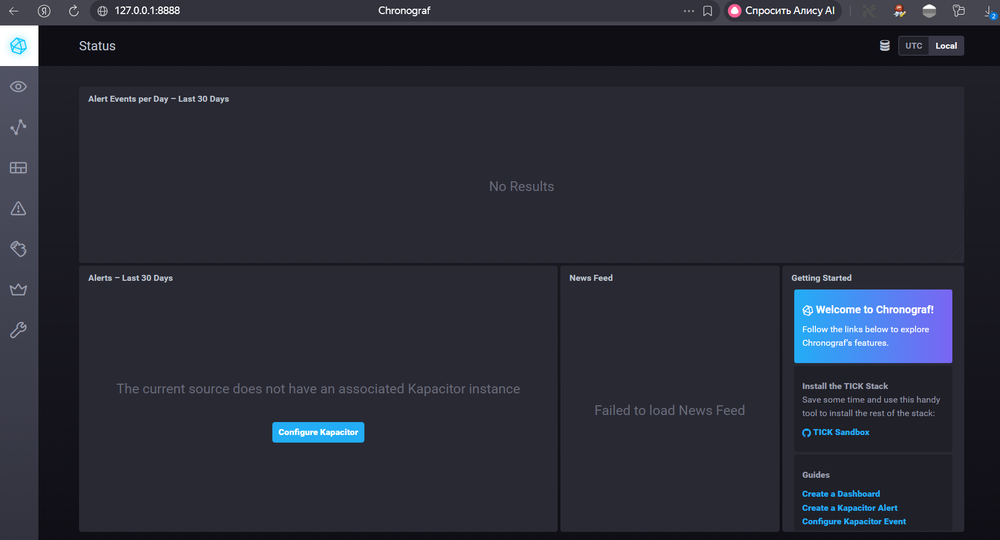
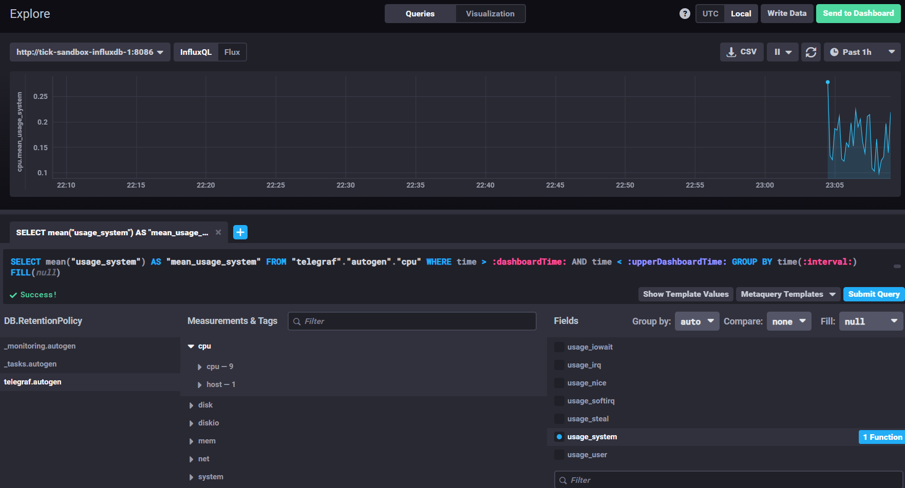
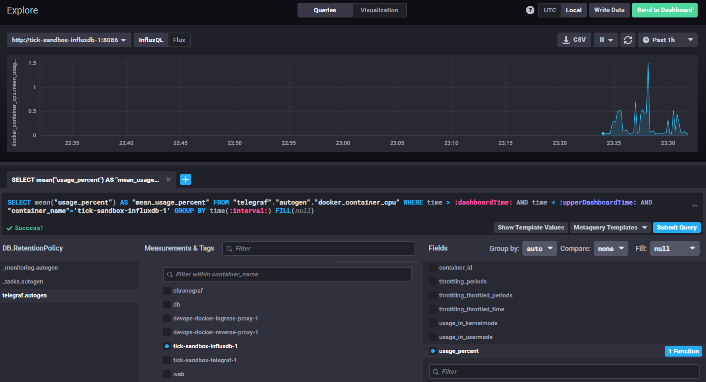

# Домашнее задание к занятию "13. Системы мониторинга"

**Выполнил:** Овсянников Сергей

[Оригинальное задание](https://github.com/netology-code/mnt-homeworks/blob/MNT-video/10-monitoring-02-systems/README.md)

---

## Теоретическая часть

### 1. Минимальный набор метрик для вычислительной платформы
Так как платформа выполняет вычисления и сохраняет отчеты на диск, критически важны следующие метрики:
*   **CPU Usage / Load Average:** Прямой индикатор нагрузки от вычислений. Позволяет понять, хватает ли ресурсов для обработки задач.
*   **RAM Usage:** Генерация отчетов может требовать много памяти. Контроль необходим для предотвращения OOM Killer.
*   **Disk I/O & Free Space:** Так как отчеты сохраняются на диск, важно отслеживать скорость записи (чтобы не было задержек) и свободное место (чтобы сервис не упал).
*   **HTTP Response Codes (2xx/4xx/5xx):** Базовый показатель доступности сервиса для клиентов.

### 2. Метрики для менеджера продукта (SLA/SLO)
Менеджеру важны бизнес-показатели качества обслуживания:
*   **Availability (Доступность):** Процент успешных запросов (2xx) за период. Формула: `(2xx requests / total requests) * 100%`.
*   **Latency (Задержка):** Время ответа сервиса (p95, p99). Клиенты не должны ждать слишком долго.
*   **Error Rate:** Процент ошибок (4xx, 5xx). Показывает стабильность работы.
*   **Throughput (RPS):** Количество обработанных запросов в секунду. Показывает производительность системы под нагрузкой.

### 3. Сбор логов без бюджета
Если нет средств на ELK/Loki, можно использовать бесплатные решения:
*   **Docker Logs:** Использовать стандартный вывод контейнеров (`stdout`/`stderr`) с драйвером `json-file`. Настроить ротацию логов (`max-size`, `max-file`) в `daemon.json`, чтобы не забить диск.
*   **Локальный анализ:** Написать простые bash-скрипты с `grep`/`awk` для поиска ошибок в локальных файлах логов.
*   **Уведомления:** Настроить отправку критических ошибок (паттернов типа "ERROR", "FATAL") в Telegram/Slack через webhook прямо из скрипта или cron-задачи.
*   **VictoriaMetrics/Loki:** Развернуть легкие open-source решения, которые требуют меньше ресурсов, чем классический ELK.

### 4. Ошибка в расчете SLA (70% вместо 99%)
Если в системе нет 4xx/5xx, но SLA низкий, значит в знаменатель формулы `summ_all_requests` попадают **неклиентские запросы**:
*   Health-checks от балансировщика нагрузки или оркестратора (Kubernetes/Docker Swarm).
*   Запросы систем мониторинга (Prometheus scraper, Telegraf inputs.http).
*   Эти запросы возвращают 200 OK, но их огромное количество "размывает" статистику реальных пользовательских запросов.
*   **Решение:** Фильтровать запросы по URL path (исключить `/health`, `/metrics`) или User-Agent при расчете SLA.

### 5. Плюсы и минусы Pull и Push систем

| Характеристика | Pull (Prometheus, Nagios) | Push (StatsD, Zabbix Active) |
| :--- | :--- | :--- |
| **Инициатива** | Сервер сам опрашивает цели | Цель сама отправляет данные |
| **Безопасность** | Серверу нужен доступ к портам целей (сложно через NAT/Firewall) | Цель инициирует соединение наружу (легко через NAT) |
| **Надежность** | Сервер сразу видит, если цель недоступна (timeout) | При обрыве сети данные могут потеряться (нужен буфер на стороне агента) |
| **Масштабируемость** | Сервер становится bottleneck при большом кол-ве целей | Легко добавлять новые источники, сервер просто принимает поток |
| **Конфигурация** | Централизованная (на сервере) | Распределенная (на каждом агенте) |

### 6. Классификация систем мониторинга
*   **Prometheus:** Pull (классическая модель scrape).
*   **TICK:** Гибридная. Telegraf собирает данные (Pull с хоста/Push от приложений) и отправляет в InfluxDB (Push). InfluxDB принимает данные.
*   **Zabbix:** Гибридная. Поддерживает Passive checks (Pull) и Active checks (Push).
*   **VictoriaMetrics:** Гибридная. Совместима с Prometheus API (Pull), но также имеет vmagent для приема Push-данных.
*   **Nagios:** Pull (активный опрос плагинов).

---

## Практическая часть

### Задание 1. Запуск TICK-стека
Склонирован репозиторий, запущен стек через Docker Compose. Исправлены проблемы совместимости версий Telegraf и InfluxDB v2 (настройка токенов, v1 auth mapping, исправление конфигов).

**Результат:** Веб-интерфейс Chronograf успешно подключен к источнику данных.

### Задание 2. Визуализация метрик CPU
В Data Explorer выбрана БД `telegraf.autogen`. Построен график утилизации системного процессора (`usage_system`).

**Результат:** График загрузки CPU хоста.

### Задание 3. Мониторинг Docker-контейнеров
В конфиг Telegraf добавлен плагин `[[inputs.docker]]`. Решена проблема прав доступа к Docker Socket (`chmod 666 /var/run/docker.sock`). Агент начал собирать метрики контейнеров.

**Результат:** График утилизации CPU контейнером `tick-sandbox-influxdb-1` (метрика `docker_container_cpu.usage_percent`).

